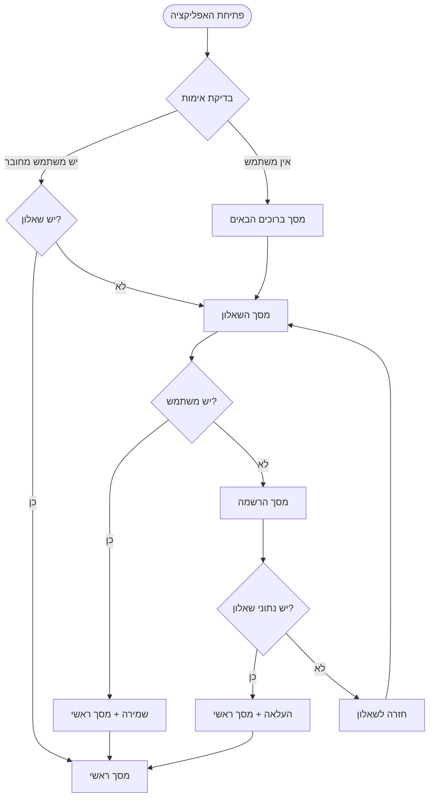

# 🗺️ זרימה כללית - אפליקציית GYMovoo

## 📋 סקירה כללית

מפת זרימה מלאה של כל המסכים והמעברים באפליקציה.

## 🎯 זרימה ראשית



## 🔍 פירוט מסכים וזרימות

### 1️⃣ נקודת כניסה - App.tsx

**מיקום:** `App.tsx`
**תפקיד:** בדיקה ראשונית של מצב המשתמש

#### 🔄 לוגיקת החלטה:

```javascript
if (user?.id && user?.hasQuestionnaire) {
  // עבור למסך ראשי
  navigate("MainApp");
} else if (user?.id && !user?.hasQuestionnaire) {
  // עבור לשאלון (משתמש קיים בלי שאלון)
  navigate("Questionnaire");
} else {
  // עבור למסך ברוכים הבאים (משתמש חדש)
  navigate("Welcome");
}
```

### 2️⃣ מסך ברוכים הבאים → מסך השאלון

**קובץ:** `WelcomeScreen.tsx` → `UnifiedQuestionnaireScreen.tsx`

#### 🎯 מטרה:

- הצגת מסך פתיחה אטרקטיבי
- מעבר לשאלון לאיסוף העדפות

#### 🔘 כפתורים:

- **"בואו נתחיל!"** → מעבר לשאלון

### 3️⃣ מסך השאלון → הרשמה/ראשי

**קובץ:** `UnifiedQuestionnaireScreen.tsx`

#### 🎯 מטרה:

- איסוף העדפות כושר
- שמירה ב-AsyncStorage
- החלטה על מסך הבא

#### 🔘 כפתורים:

- **"בואו נתחיל!"** (אחרי סיום) → בדיקה:
  - אם יש `user?.id` → שמירה בשרת + מסך ראשי
  - אם אין `user?.id` → מסך הרשמה

### 4️⃣ מסך הרשמה → שאלון/ראשי

**קובץ:** `RegisterScreen.tsx`

#### 🎯 מטרה:

- יצירת חשבון משתמש
- בדיקת נתוני שאלון קיימים
- החלטה על מסך הבא

#### 🔘 כפתורים:

- **"צור חשבון"** → אחרי הרשמה מוצלחת:
  - בדיקה אם יש נתוני שאלון ב-AsyncStorage
  - אם כן → העלאה לשרת + מסך ראשי
  - אם לא → מסך שאלון
- **"הרשמה עם Google"** → אותו לוגיק
- **"התחבר עכשיו"** → מסך התחברות

### 5️⃣ מסך התחברות → ראשי/שאלון

**קובץ:** `LoginScreen.tsx`

#### 🔘 כפתורים:

- **"התחבר"** → אחרי התחברות:
  - אם יש שאלון → מסך ראשי
  - אם אין → מסך שאלון
- **"צור חשבון"** → מסך הרשמה

### 6️⃣ מסך ראשי - מרכז השליטה

**קובץ:** `MainScreen.tsx`

#### 🔘 כפתורים עיקריים:

- **"התחל אימון"** → מסך אימון
- **"פרופיל"** → מסך פרופיל
- **"היסטוריה"** → מסך היסטוריה

## 💾 נקודות שמירת מידע

### 📱 AsyncStorage

```javascript
// שמירה זמנית של נתוני שאלון
"questionnaire_metadata" - מטאדטה של השאלון
"smart_questionnaire_results" - תשובות השאלון
"questionnaire_draft" - טיוטה במהלך מילוי
"user_logged_out" - דגל התנתקות
```

### 🏪 Zustand Store

```javascript
// מצב אפליקציה פעיל
user: {
  (id,
    email,
    name, // פרטי בסיס
    hasQuestionnaire, // האם יש שאלון
    smartquestionnairedata, // נתוני שאלון
    trainingstats); // סטטיסטיקות אימון
}
```

### ☁️ Supabase

```sql
-- טבלת משתמשים
users {
  id, email, name,
  smartquestionnairedata,
  trainingstats,
  hasQuestionnaire
}
```

## ⚠️ בעיות זוהו ותוקנו

### 🔴 בעיה: משתמש עושה שאלון פעמיים

**תיאור:** אחרי הרשמה המשתמש מועבר לשאלון גם אם כבר מילא

**✅ פתרון מיושם:**

1. שמירת נתוני שאלון ב-AsyncStorage לפני הרשמה
2. בדיקה ב-RegisterScreen אחרי הרשמה
3. אם יש נתונים → העלאה לשרת + מעבר למסך ראשי
4. הוספת בדיקה ב-QuestionnaireScreen - אם יש שאלון → מעבר ישר לראשי

### 🔴 בעיה: אימות אימייל לא עבד

**תיאור:** ולידציה של אימייל הייתה הפוכה

**✅ פתרון מיושם:**

```javascript
// לפני - לא נכון
if (sharedValidateEmail(email)) errors.email = "...";

// אחרי - נכון
const emailError = sharedValidateEmail(email);
if (emailError) errors.email = emailError;
```

### 🔴 בעיה: נפילה של Supabase עוצרת רישום

**תיאור:** אם Supabase לא זמין, הרישום נכשל לגמרי

**✅ פתרון מיושם:**

1. fallback ל-localDataService במצב פיתוח
2. טיפול באשר try-catch מקונן
3. הודעות שגיאה ברורות

## 🔮 הצעות לשיפורים עתידיים

### 1️⃣ מטמון חכם

- שמירה מקומית של נתוני אימון
- סנכרון ברקע כשיש רשת
- עבודה במצב offline

### 2️⃣ אנליטיקה משופרת

- מעקב אחר זרימת המשתמש
- זיהוי נקודות נשירה
- אופטימיזציה של UX

### 3️⃣ שחזור מפתח

- שחזור סיסמה באימייל
- קישור זמני לכניסה
- אימות דו-שלבי

---

_עודכן: 4 בספטמבר 2025_
