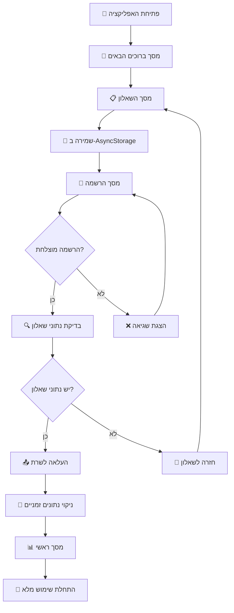

# 🎯 זרימת משתמש חדש - מהתחלה ועד שימוש מלא

> **מטרה:** תיעוד מפורט של התהליך המלא שמשתמש חדש עובר באפליקציה

## 🚀 תרחיש מלא: משתמש חדש רוצה להתחיל להתאמן

### שלב 1️⃣: פתיחת האפליקציה

**מיקום:** `App.tsx` - נקודת כניסה

```javascript
// בדיקה ראשונית
if (!user) {
  // משתמש חדש - עבור למסך ברוכים הבאים
  navigate("Welcome");
}
```

**תוצאה:** 👋 **מסך ברוכים הבאים**

---

### שלב 2️⃣: מסך ברוכים הבאים

**קובץ:** `WelcomeScreen.tsx`  
**מה המשתמש רואה:**

- כותרת: "ברוכים הבאים ל-GYMovoo"
- סטטיסטיקות: "2,847 משתמשים פעילים"
- כפתור גדול: **"בואו נתחיל!"**

**פעולת המשתמש:** לוחץ על "בואו נתחיל!"

```javascript
const handleStartJourney = () => {
  navigation.navigate("Questionnaire");
};
```

**תוצאה:** 📋 **מסך השאלון**

---

### שלב 3️⃣: מסך השאלון

**קובץ:** `UnifiedQuestionnaireScreen.tsx`  
**מה המשתמש רואה:**

- כותרת: "בואו נכיר אותך"
- בר התקדמות: "1/8"
- שאלה ראשונה: "באיזה קבוצת גיל אתה נמצא?"

**תהליך המשתמש:**

1. ענה על 8 שאלות (גיל, מטרות, ציוד, זמינות)
2. בכל תשובה - שמירה ב-AsyncStorage
3. בסיום - לוחץ על **"בואו נתחיל!"**

#### 💾 מה נשמר במהלך השאלון:

```javascript
// AsyncStorage
"questionnaire_draft" = {
  answers: [
    { questionId: "age", value: "25_35" },
    { questionId: "goals", value: ["strength", "weight_loss"] },
    { questionId: "equipment", value: ["dumbbells", "bodyweight"] },
    // ... שאר התשובות
  ],
  progress: 100,
  completedAt: "2025-09-04T10:30:00Z"
}
```

#### 🔍 בדיקה בסיום השאלון:

```javascript
if (!user?.id) {
  // אין משתמש מחובר - שמור נתונים ועבור להרשמה
  await AsyncStorage.setItem(
    "smart_questionnaire_results",
    JSON.stringify(data)
  );
  navigation.navigate("Register");
}
```

**תוצאה:** 🔐 **מסך הרשמה**

---

### שלב 4️⃣: מסך הרשמה

**קובץ:** `RegisterScreen.tsx`  
**מה המשתמש רואה:**

- כותרת: "יצירת חשבון חדש"
- טופס: שם מלא, אימייל, סיסמה, אישור סיסמה
- תיבות סימון: גיל 16+, תנאי שימוש
- כפתור: **"צור חשבון"**

**תהליך המשתמש:**

1. ממלא את הטופס: "ישראל ישראלי", "israel@example.com", "MyPass123!"
2. מסמן ✅ גיל 16+ ו ✅ תנאי שימוש
3. לוחץ על **"צור חשבון"**

#### 🔄 מה קורה ברקע:

```javascript
const handleRegister = async () => {
  // 1. ולידציה עברה ✅
  // 2. יצירת אובייקט משתמש
  const newUser = {
    email: "israel@example.com",
    name: "ישראל ישראלי",
    id: "user_1725456789123",
    provider: "manual"
  }

  // 3. ניסיון שמירה ב-Supabase (נכשל ❌)
  // 4. fallback ל-localDataService (הצליח ✅)
  savedUser = localDataService.addUser(newUser)

  // 5. שמירה ב-Zustand Store
  useUserStore.getState().setUser(savedUser)

  // 6. בדיקת נתוני שאלון
  const questionnaireData = await AsyncStorage.getItem("smart_questionnaire_results")
  // יש נתונים! ✅

  // 7. עדכון המשתמש עם נתוני השאלון
  const userWithQuestionnaire = {
    ...savedUser,
    smartquestionnairedata: { answers: questionnaireData, metadata: {...} },
    hasQuestionnaire: true,
    trainingstats: {
      selectedEquipment: ["dumbbells", "bodyweight"],
      fitnessGoals: ["strength", "weight_loss"]
    }
  }

  // 8. שמירה מעודכנת
  useUserStore.getState().setUser(userWithQuestionnaire)

  // 9. ניקוי נתונים זמניים
  await AsyncStorage.multiRemove([
    "questionnaire_metadata",
    "smart_questionnaire_results",
    "questionnaire_draft"
  ])

  // 10. מעבר למסך ראשי!
  navigation.reset({ index: 0, routes: [{ name: "MainApp" }] })
}
```

**תוצאה:** 📊 **מסך ראשי**

---

### שלב 5️⃣: מסך ראשי - שימוש מלא!

**קובץ:** `MainScreen.tsx`  
**מה המשתמש רואה:**

- כותרת: "שלום ישראל ישראלי"
- סטטיסטיקות: "0 אימונים, 0 דקות, רצף: 0 ימים"
- כרטיס המלצות: "מומלץ לך להתחיל באימון כוח בסיסי"
- כפתור גדול: **"התחל אימון"**

**פעולת המשתמש:** לוחץ על "התחל אימון"

#### 🎯 מה קורה:

```javascript
const handleStartWorkout = () => {
  // בדיקה - האם יש תוכנית אימון?
  const workoutPlan = user?.workoutplans?.smartPlan;

  if (!workoutPlan) {
    // אין תוכנית - צור תוכנית חדשה לפי נתוני השאלון
    navigation.navigate("WorkoutPlans", { autoGenerate: true });
  }
};
```

**תוצאה:** 🗂️ **מסך תוכניות אימון** (יצירה אוטומטית)

---

## 💾 מצב הנתונים בסיום התהליך

### 🏪 Zustand Store

```javascript
user: {
  id: "user_1725456789123",
  email: "israel@example.com",
  name: "ישראל ישראלי",
  provider: "manual",
  hasQuestionnaire: true,
  smartquestionnairedata: {
    answers: {
      age: "25_35",
      goals: ["strength", "weight_loss"],
      equipment: ["dumbbells", "bodyweight"],
      frequency: "3_4_times",
      duration: "30_45_minutes"
    },
    metadata: {
      completedAt: "2025-09-04T10:30:00Z",
      version: "2.0"
    }
  },
  trainingstats: {
    totalWorkouts: 0,
    totalMinutes: 0,
    currentStreak: 0,
    selectedEquipment: ["dumbbells", "bodyweight"],
    fitnessGoals: ["strength", "weight_loss"],
    currentFitnessLevel: "beginner"
  }
}
```

### 📱 AsyncStorage

```javascript
// נוקה מנתונים זמניים ✅
"questionnaire_draft" - deleted
"smart_questionnaire_results" - deleted
"questionnaire_metadata" - deleted

// נתונים קבועים
"last_email" - israel@example.com (אם בחר "זכור אותי")
```

### 💾 LocalDataService (פיתוח)

```javascript
users: [
  {
    id: "user_1725456789123",
    email: "israel@example.com",
    name: "ישראל ישראלי",
    hasQuestionnaire: true,
    smartquestionnairedata: {
      /* נתוני השאלון */
    },
    trainingstats: {
      /* סטטיסטיקות */
    },
  },
];
```

---

## 🔄 זרימה חזותית מלאה



---

## ⏱️ זמני ביצוע משוערים

| שלב              | זמן משוער     | פעולות משתמש       |
| ---------------- | ------------- | ------------------ |
| מסך ברוכים הבאים | 10-30 שניות   | קריאה + לחיצה      |
| מילוי שאלון      | 2-5 דקות      | 8 שאלות            |
| הרשמה            | 1-3 דקות      | מילוי טופס         |
| העלאה ועיבוד     | 5-15 שניות    | אוטומטי            |
| הכרת מסך ראשי    | 30-60 שניות   | סקירה              |
| **סה"כ**         | **4-10 דקות** | **onboarding מלא** |

---

## 🎯 נקודות הצלחה קריטיות

### ✅ שלב השאלון

- שמירה זמנית מונעת איבוד נתונים
- ממשק אינטואיטיבי ומהיר
- התקדמות ברורה

### ✅ שלב ההרשמה

- ולידציה מיידית מונעת שגיאות
- fallback מבטיח הצלחה במצב פיתוח
- בדיקת נתוני שאלון אוטומטית

### ✅ שלב המעבר לראשי

- העלאה אוטומטית של נתונים
- ניקוי מדויק של נתונים זמניים
- מסך ראשי מותאם אישית מיד

---

## 🔮 מקרי קצה וטיפול בהם

### 🔴 המשתמש יוצא באמצע השאלון

**פתרון:** שמירה זמנית ב-AsyncStorage + אפשרות להמשיך

### 🔴 שגיאת רשת במהלך הרשמה

**פתרון:** fallback ל-localDataService במצב פיתוח

### 🔴 המשתמש סוגר את האפליקציה אחרי השאלון לפני הרשמה

**פתרון:** נתוני השאלון נשמרים ב-AsyncStorage ויטענו בכניסה הבאה

### 🔴 הרשמה מוצלחת אבל העלאת השאלון נכשלת

**פתרון:** המשתמש יועבר לשאלון חדש (התנהגות נוכחית)

---

_עודכן: 4 בספטמבר 2025_
