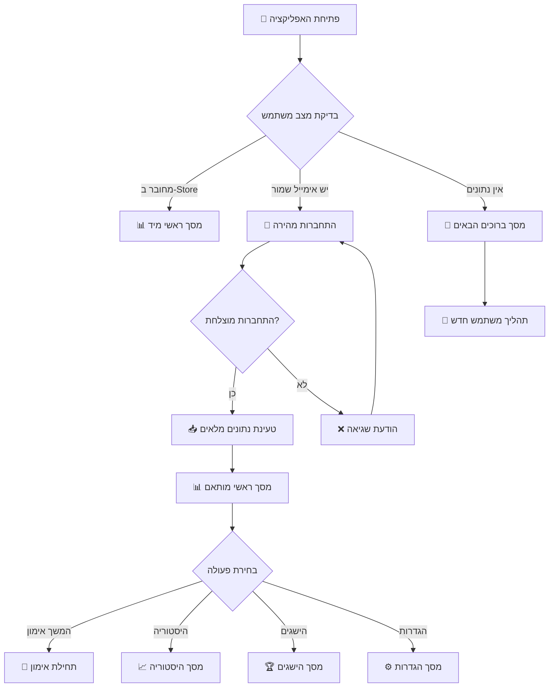

# 🔁 זרימת משתמש קיים - התחברות וחזרה לפעילות

> **מטרה:** תיעוד מפורט של התהליך שמשתמש רשום עובר כשחוזר לאפליקציה

## 🏠 תרחיש מלא: משתמש קיים חוזר לאפליקציה

### שלב 1️⃣: פתיחת האפליקציה - בדיקה אוטומטית

**מיקום:** `App.tsx` - נקודת כניסה

```javascript
// בדיקה ראשונית בעת טעינה
useEffect(() => {
  const checkUserState = async () => {
    const user = useUserStore.getState().user;
    const savedEmail = await AsyncStorage.getItem("last_email");

    if (user?.id) {
      // משתמש מחובר - עבור למסך ראשי
      navigation.reset({ index: 0, routes: [{ name: "MainApp" }] });
    } else if (savedEmail) {
      // יש אימייל שמור - עבור להתחברות עם השלמה אוטומטית
      navigation.navigate("Login", { prefilledEmail: savedEmail });
    } else {
      // אין נתונים - עבור למסך ברוכים הבאים
      navigation.navigate("Welcome");
    }
  };

  checkUserState();
}, []);
```

#### 🔄 3 תרחישים אפשריים:

---

## 🎯 תרחיש A: משתמש מחובר (רוב המקרים)

### ✅ המשתמש כבר מחובר ב-Zustand Store

**תוצאה מיידית:** 📊 **מסך ראשי**

**מה המשתמש רואה:**

- כותרת: "שלום ישראל ישראלי"
- סטטיסטיקות עדכניות: "12 אימונים, 360 דקות, רצף: 5 ימים"
- המלצות מותאמות אישית
- כפתור: **"התחל אימון"**

**נתונים זמינים מיד:**

```javascript
user: {
  id: "user_1725456789123",
  name: "ישראל ישראלי",
  trainingstats: {
    totalWorkouts: 12,
    totalMinutes: 360,
    currentStreak: 5,
    lastWorkout: "2025-09-03T18:30:00Z"
  },
  workoutplans: {
    smartPlan: { /* תוכנית אימון פעילה */ }
  }
}
```

---

## 🔑 תרחיש B: יש אימייל שמור - התחברות מהירה

### שלב 2️⃣: מסך התחברות עם השלמה אוטומטית

**קובץ:** `LoginScreen.tsx`  
**מה המשתמש רואה:**

- כותרת: "התחברות"
- שדה אימייל מלא מראש: "israel@example.com" ✅
- שדה סיסמה ריק
- תיבת סימון מסומנת: ✅ "זכור אותי"
- כפתור: **"התחבר"**

**פעולת המשתמש:** מזין רק סיסמה + לוחץ "התחבר"

#### 🔍 תהליך התחברות:

```javascript
const handleLogin = async () => {
  // 1. ולידציה מקומית
  if (!email || !password) return;

  // 2. ניסיון התחברות Supabase (עלול להיכשל)
  try {
    const { data, error } = await supabase.auth.signInWithPassword({
      email: "israel@example.com",
      password: "MyPass123!",
    });
    // אם הצליח - המשך ב-Supabase flow
  } catch {
    // 3. fallback ל-localDataService
    const user = localDataService.findUserByEmail("israel@example.com");

    if (user) {
      // 4. התחברות מוצלחת!
      useUserStore.getState().setUser(user);

      // 5. שמירת אימייל אם "זכור אותי" מסומן
      if (rememberMe) {
        await AsyncStorage.setItem("last_email", email);
      }

      // 6. מעבר למסך ראשי
      navigation.reset({ index: 0, routes: [{ name: "MainApp" }] });
    }
  }
};
```

**תוצאה:** 📊 **מסך ראשי** עם כל הנתונים

---

## 👋 תרחיש C: אין נתונים שמורים

### ↩️ חזרה לתהליך משתמש חדש

**תוצאה:** 👋 **מסך ברוכים הבאים**

המשתמש יעבור את אותו תהליך כמו משתמש חדש, אבל עם הבדלים:

#### 🔍 בדיקה במסך השאלון:

```javascript
// אם המשתמש מזין אימייל קיים בסיום השאלון
const checkExistingUser = async (email) => {
  const existingUser = localDataService.findUserByEmail(email);

  if (existingUser) {
    // משתמש קיים - הצע התחברות במקום הרשמה
    Alert.alert(
      "המשתמש כבר רשום",
      "האימייל הזה כבר רשום במערכת. תרצה להתחבר?",
      [
        { text: "הרשמה חדשה", onPress: () => proceedToRegister() },
        {
          text: "התחברות",
          onPress: () =>
            navigation.navigate("Login", { prefilledEmail: email }),
        },
      ]
    );
  }
};
```

---

## 💾 מצב הנתונים לאחר התחברות מוצלחת

### 🏪 Zustand Store - נתונים מלאים

```javascript
user: {
  id: "user_1725456789123",
  email: "israel@example.com",
  name: "ישראל ישראלי",
  provider: "manual",
  hasQuestionnaire: true,
  smartquestionnairedata: {
    answers: {
      age: "25_35",
      goals: ["strength", "weight_loss"],
      equipment: ["dumbbells", "bodyweight"],
      frequency: "3_4_times",
      duration: "30_45_minutes"
    },
    metadata: {
      completedAt: "2025-09-01T10:30:00Z",
      version: "2.0"
    }
  },
  trainingstats: {
    totalWorkouts: 12,
    totalMinutes: 360,
    currentStreak: 5,
    lastWorkout: "2025-09-03T18:30:00Z",
    selectedEquipment: ["dumbbells", "bodyweight"],
    fitnessGoals: ["strength", "weight_loss"],
    currentFitnessLevel: "intermediate", // התקדם מ-beginner
    weeklyProgress: {
      currentWeek: 38,
      workoutsThisWeek: 3,
      minutesThisWeek: 135
    }
  },
  workoutplans: {
    smartPlan: {
      id: "plan_strength_intermediate_v2",
      name: "תוכנית כוח מתקדמת",
      createdAt: "2025-09-01T11:00:00Z",
      exercises: [
        {
          id: "ex_001",
          name: "סקוואט עם משקולות",
          equipment: "dumbbells",
          targetMuscles: ["quadriceps", "glutes"],
          sets: 3,
          reps: "12-15",
          restTime: 60
        }
        // ... שאר התרגילים
      ],
      difficulty: "intermediate",
      estimatedDuration: 45
    }
  },
  preferences: {
    notifications: true,
    reminderTime: "18:00",
    language: "he",
    units: "metric"
  },
  analytics: {
    loginCount: 15,
    lastLoginDate: "2025-09-04T09:15:00Z",
    averageSessionDuration: 12, // דקות
    favoriteExercises: ["squat", "pushup", "plank"],
    mostActiveDay: "tuesday"
  }
}
```

### 📱 AsyncStorage - נתונים נוספים

```javascript
"last_email" = "israel@example.com"
"workout_history" = [
  {
    date: "2025-09-03",
    planId: "plan_strength_intermediate_v2",
    duration: 42,
    exercises: [
      { exerciseId: "ex_001", sets: 3, actualReps: [15, 14, 12] },
      { exerciseId: "ex_002", sets: 3, actualReps: [12, 11, 10] }
    ],
    rating: 4,
    notes: "הרגשתי חזק היום!"
  }
  // ... אימונים קודמים
]

"user_preferences" = {
  darkMode: false,
  autoStartWorkouts: true,
  playworkoutSounds: true,
  vibrationEnabled: true
}

"achievement_progress" = {
  "first_workout": { unlocked: true, date: "2025-09-01" },
  "week_streak": { unlocked: true, date: "2025-09-02" },
  "month_consistent": { progress: 23, target: 30 }
}
```

---

## 📊 מסך ראשי - תוכן מותאם למשתמש קיים

### 🎯 מה המשתמש רואה:

- **כותרת אישית:** "שלום ישראל, יום שלישי טוב!"
- **סטטיסטיקות:** "12 אימונים השבוע, 360 דקות, רצף 5 ימים 🔥"
- **התקדמות שבועית:** בר התקדמות 75% (3 מתוך 4 אימונים)
- **המלצה חכמה:** "מצוין! תוכנית הכוח שלך מתאימה לך. בואו נמשיך היום עם אימון רגליים"
- **כפתור ראשי:** "המשך אימון" (במקום "התחל אימון")

### 🔥 תכונות מתקדמות זמינות:

```javascript
// כפתורים נוספים במסך ראשי
[
  { text: "המשך אימון", action: "continueWorkout", primary: true },
  { text: "היסטוריית אימונים", action: "viewHistory", icon: "📈" },
  { text: "מטרות שבועיות", action: "weeklyGoals", icon: "🎯" },
  { text: "הישגים", action: "achievements", icon: "🏆" },
  { text: "עדכן תוכנית", action: "updatePlan", icon: "⚙️" },
];
```

### 📈 ניתוח התקדמות אוטומטי:

```javascript
const progressAnalysis = {
  trend: "improving", // משתפר!
  weeklyConsistency: 75, // 3 מתוך 4 אימונים
  strengthProgress: "+15%", // עלייה בכוח
  recommendations: [
    "נוסיפות הרבה משקל - שקלו להגדיל עומס",
    "הרצף שלכם מעולה - שמרו על זה!",
    "אימון כוח מקפיץ הרפה - תוסיפו יום קרדיו",
  ],
};
```

---

## 🔄 זרימה חזותית - משתמש קיים



---

## ⏱️ זמני טעינה - משתמש קיים

| תרחיש               | זמן טעינה   | פעולת משתמש        |
| ------------------- | ----------- | ------------------ |
| **מחובר ב-Store**   | 0.5-1 שניות | אוטומטי למסך ראשי  |
| **התחברות מהירה**   | 2-5 שניות   | סיסמה + כניסה      |
| **התחברות + טעינה** | 3-8 שניות   | כולל טעינת נתונים  |
| **fallback למקומי** | 1-2 שניות   | במקרה של שגיאת רשת |

---

## 🎯 יתרונות חוויית משתמש קיים

### ✅ מהירות וזרימה

- **אין צורך בשאלון חוזר** - הנתונים כבר קיימים
- **התחברות מהירה** - אימייל מולא מראש
- **מסך ראשי מותאם** - תוכן אישי מיד

### ✅ המשכיות

- **היסטוריית אימונים** - מעקב אחר התקדמות
- **הישגים ורצפים** - מוטיבציה מתמשכת
- **המלצות מתקדמות** - על בסיס ביצועים קודמים

### ✅ אמינות

- **שמירה מקומית** - עובד גם בלי אינטרנט
- **סינכרון חכם** - עדכון נתונים כשיש קשר
- **fallback מהימן** - אף פעם לא "תקוע"

---

## 🔮 תרחישי קצה - משתמש קיים

### 🔴 שכח סיסמה

```javascript
// כפתור "שכחתי סיסמה" במסך התחברות
const handleForgotPassword = () => {
  Alert.alert("איפוס סיסמה", "במצב פיתוח - פנה למפתח", [
    { text: "אישור", onPress: () => {} },
  ]);
};
```

### 🔴 נתונים לא מסונכרנים

```javascript
// בדיקה בכניסה למסך ראשי
useEffect(() => {
  const syncUserData = async () => {
    try {
      // ניסיון סינכרון עם השרת
      const serverData = await userApi.getUserData(user.id);
      if (serverData && serverData.lastUpdated > user.lastUpdated) {
        // יש נתונים חדשים יותר בשרת
        useUserStore.getState().setUser(serverData);
      }
    } catch {
      // אין בעיה - נמשיך עם הנתונים המקומיים
    }
  };

  syncUserData();
}, []);
```

### 🔴 משתמש מתחבר במכשיר חדש

```javascript
// בעת התחברות מוצלחת על מכשיר חדש
const handleFirstLoginOnDevice = async (user) => {
  // 1. טען נתונים מהשרת
  const fullUserData = await userApi.getCompleteUserProfile(user.id);

  // 2. שמור מקומית
  useUserStore.getState().setUser(fullUserData);

  // 3. הודע למשתמש
  Alert.alert("ברוך השב!", "הנתונים שלך נטענו בהצלחה למכשיר זה", [
    { text: "המשך", onPress: () => navigation.navigate("MainApp") },
  ]);
};
```

---

_עודכן: 4 בספטמבר 2025_
