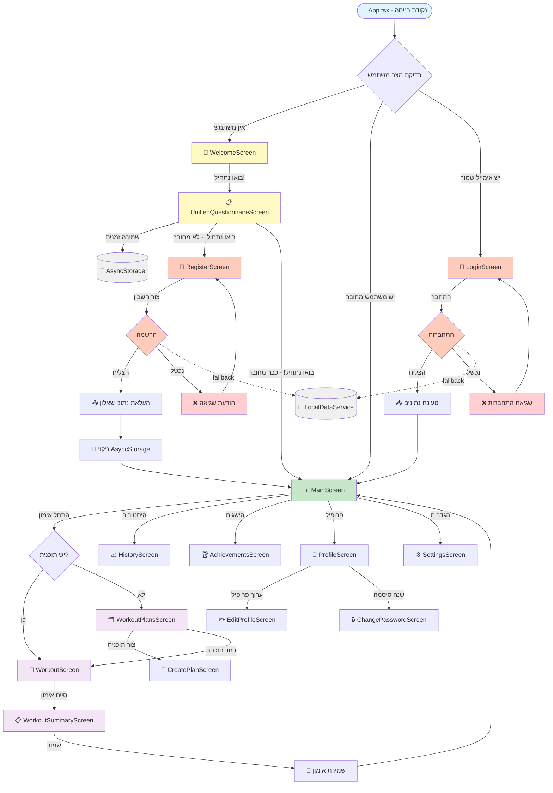
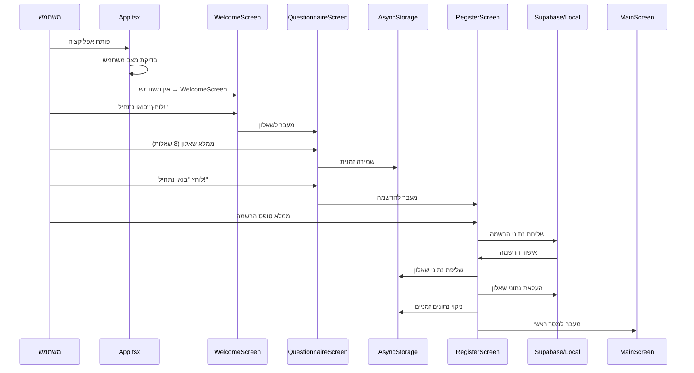
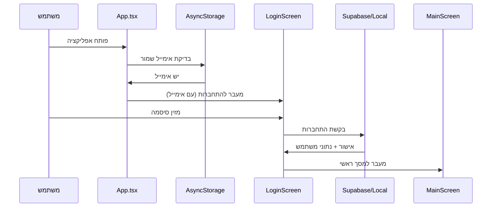
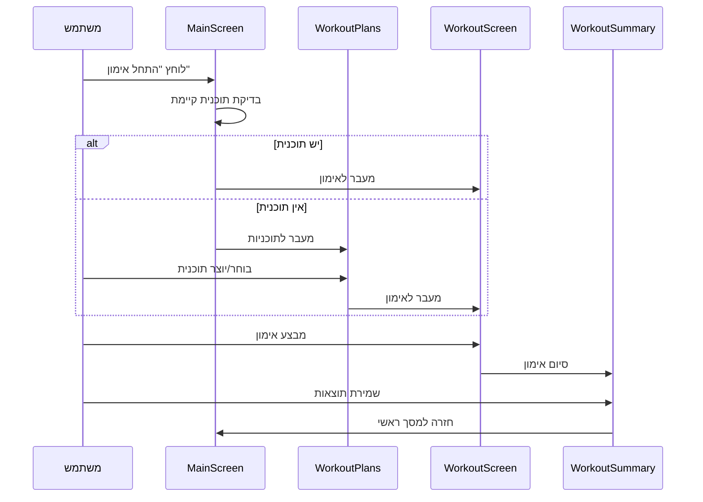

# 🗺️ מפת הפרויקט המלאה - GYMovoo

> **דיאגרמה מלאה של כל הזרימות, מסכים וקשרים באפליקציה**

## 🎯 סקירה כללית

**GYMovoo** הוא אפליקציית fitness מותאמת אישית המבוססת על:

- **React Native** + **TypeScript** + **Expo**
- **Zustand** לניהול state
- **Supabase** (עם fallback מקומי למצב פיתוח)
- **AsyncStorage** לשמירה מקומית
- **React Navigation** לניווט

---

## 🗺️ דיאגרמה מלאה של כל המסכים



---

## 📁 מבנה קבצים מפורט

### 🎯 קבצי הגדרה ובסיס

```
📁 GYMovoo/
├── 📄 App.tsx                    # נקודת כניסה ראשית
├── 📄 app.json                   # הגדרות Expo
├── 📄 package.json               # תלותים ופקודות
├── 📄 tsconfig.json              # הגדרות TypeScript
├── 📄 babel.config.js            # הגדרות Babel
├── 📄 jest.config.js             # הגדרות בדיקות
└── 📄 eslint.config.mjs          # הגדרות ESLint
```

### 🎨 נכסים ומשאבים

```
📁 assets/
├── 🖼️ icon.png                  # אייקון אפליקציה
├── 🖼️ splash-icon.png           # מסך פתיחה
├── 🖼️ welcome.png               # תמונת ברוכים הבאים
├── 🖼️ favicon.png               # פביקון
└── 📁 equipment/                # ציוד אימון
    ├── 🖼️ dumbbells.png
    ├── 🖼️ barbell.png
    ├── 🖼️ treadmill.png
    └── ...
```

### 💻 קוד המקור

```
📁 src/
├── 📁 components/               # רכיבים משותפים
│   ├── 📄 Button.tsx
│   ├── 📄 Input.tsx
│   ├── 📄 LoadingSpinner.tsx
│   └── 📄 ErrorBoundary.tsx
│
├── 📁 screens/                  # מסכי האפליקציה
│   ├── 📄 WelcomeScreen.tsx     # 👋 ברוכים הבאים
│   ├── 📄 UnifiedQuestionnaireScreen.tsx # 📋 שאלון
│   ├── 📄 RegisterScreen.tsx    # 🔐 הרשמה
│   ├── 📄 LoginScreen.tsx       # 🔑 התחברות
│   ├── 📄 MainScreen.tsx        # 📊 מסך ראשי
│   ├── 📄 WorkoutScreen.tsx     # 🏃 אימון
│   ├── 📄 ProfileScreen.tsx     # 👤 פרופיל
│   └── ...
│
├── 📁 navigation/               # ניווט
│   ├── 📄 AppNavigator.tsx      # ניווט ראשי
│   ├── 📄 AuthNavigator.tsx     # ניווט אימות
│   └── 📄 MainNavigator.tsx     # ניווט אפליקציה
│
├── 📁 stores/                   # ניהול state
│   ├── 📄 userStore.ts          # Zustand - נתוני משתמש
│   ├── 📄 workoutStore.ts       # Zustand - אימונים
│   └── 📄 appStore.ts           # Zustand - הגדרות כלליות
│
├── 📁 services/                 # שירותים
│   ├── 📄 supabaseClient.ts     # קליינט Supabase
│   ├── 📄 localDataService.ts   # שירות נתונים מקומי
│   ├── 📄 userApi.ts            # API משתמשים
│   ├── 📄 workoutApi.ts         # API אימונים
│   └── 📄 analyticsService.ts   # analytics
│
├── 📁 types/                    # הגדרות טיפוסים
│   └── 📄 index.ts              # כל הטיפוסים
│
├── 📁 utils/                    # פונקציות עזר
│   ├── 📄 validation.ts         # ולידציות
│   ├── 📄 dateUtils.ts          # פונקציות תאריך
│   └── 📄 constants.ts          # קבועים
│
├── 📁 data/                     # נתונים קבועים
│   ├── 📄 exercises.ts          # רשימת תרגילים
│   ├── 📄 equipment.ts          # רשימת ציוד
│   └── 📄 questionnaireData.ts  # נתוני שאלון
│
└── 📁 styles/                   # עיצוב
    ├── 📄 theme.ts              # נושא עיצוב
    ├── 📄 colors.ts             # צבעים
    └── 📄 typography.ts         # פונטים
```

---

## 🔄 זרימות נתונים עיקריות

### 1️⃣ זרימת משתמש חדש



### 2️⃣ זרימת משתמש קיים



### 3️⃣ זרימת אימון



---

## 💾 ארכיטקטורת נתונים

### 🏪 Zustand Store - מצב האפליקציה

```typescript
// User Store - נתוני משתמש עיקריים
interface UserState {
  user: User | null;
  isLoading: boolean;
  error: string | null;
  setUser: (user: User) => void;
  clearUser: () => void;
  updateUserStats: (stats: TrainingStats) => void;
}

// Workout Store - נתוני אימונים
interface WorkoutState {
  currentWorkout: Workout | null;
  workoutHistory: WorkoutSession[];
  activeWorkoutPlans: WorkoutPlan[];
  startWorkout: (plan: WorkoutPlan) => void;
  endWorkout: (summary: WorkoutSummary) => void;
}

// App Store - הגדרות כלליות
interface AppState {
  theme: "light" | "dark";
  language: "he" | "en";
  notifications: boolean;
  isOnline: boolean;
}
```

### 📱 AsyncStorage - שמירה מקומית

```typescript
// נתונים זמניים
"questionnaire_draft"; // טיוטת שאלון
"smart_questionnaire_results"; // תוצאות שאלון
"questionnaire_metadata"; // מטא-דאטה

// נתונים קבועים
"last_email"; // אימייל אחרון
"workout_history"; // היסטוריית אימונים
"user_preferences"; // העדפות משתמש
"achievement_progress"; // התקדמות הישגים
"offline_workouts"; // אימונים לא מסונכרנים
```

### 🌐 Supabase + Local Fallback

```typescript
// טבלאות Supabase
users              // פרטי משתמשים
workout_plans       // תוכניות אימון
workout_sessions    // סשני אימון
user_achievements   // הישגי משתמשים
exercises           // מאגר תרגילים

// LocalDataService (fallback)
const localData = {
  users: User[],
  workoutPlans: WorkoutPlan[],
  workoutSessions: WorkoutSession[],
  exercises: Exercise[]
}
```

---

## 🎯 נקודות חיבור קריטיות

### 🔗 App.tsx - נקודת הכניסה

```typescript
function App() {
  const { user } = useUserStore()

  return (
    <NavigationContainer>
      {user ? (
        <MainNavigator />     // משתמש מחובר
      ) : (
        <AuthNavigator />     // לא מחובר
      )}
    </NavigationContainer>
  )
}
```

### 🔗 Navigation Structure

```typescript
// AuthNavigator - לפני התחברות
function AuthNavigator() {
  return (
    <Stack.Navigator>
      <Stack.Screen name="Welcome" component={WelcomeScreen} />
      <Stack.Screen name="Questionnaire" component={UnifiedQuestionnaireScreen} />
      <Stack.Screen name="Register" component={RegisterScreen} />
      <Stack.Screen name="Login" component={LoginScreen} />
    </Stack.Navigator>
  )
}

// MainNavigator - אחרי התחברות
function MainNavigator() {
  return (
    <Tab.Navigator>
      <Tab.Screen name="Home" component={MainScreen} />
      <Tab.Screen name="Workouts" component={WorkoutNavigator} />
      <Tab.Screen name="History" component={HistoryScreen} />
      <Tab.Screen name="Profile" component={ProfileScreen} />
    </Tab.Navigator>
  )
}
```

### 🔗 Data Flow Critical Points

```typescript
// נקודת חיבור 1: תחילת אפליקציה
App.tsx → בדיקת מצב משתמש → ניווט מתאים

// נקודת חיבור 2: סיום שאלון
QuestionnaireScreen → שמירה ב-AsyncStorage → מעבר להרשמה

// נקודת חיבור 3: הרשמה מוצלחת
RegisterScreen → העלאת נתוני שאלון → ניקוי זמני → מסך ראשי

// נקודת חיבור 4: התחברות מוצלחת
LoginScreen → טעינת נתוני משתמש → מסך ראשי

// נקודת חיבור 5: סיום אימון
WorkoutScreen → שמירת תוצאות → עדכון סטטיסטיקות → מסך ראשי
```

---

## 🔧 הגדרות פיתוח ותפעול

### 📦 Dependencies עיקריות

```json
{
  "expo": "~51.0.28",
  "react": "18.2.0",
  "react-native": "0.74.5",
  "@react-navigation/native": "^6.0.0",
  "zustand": "^4.0.0",
  "@supabase/supabase-js": "^2.0.0",
  "@react-native-async-storage/async-storage": "^1.0.0",
  "expo-linear-gradient": "~13.0.2"
}
```

### 🎨 Design System

```typescript
// colors.ts
export const colors = {
  primary: "#6366f1",
  secondary: "#ec4899",
  success: "#10b981",
  warning: "#f59e0b",
  error: "#ef4444",
  background: "#ffffff",
  surface: "#f8fafc",
};

// typography.ts
export const typography = {
  h1: { fontSize: 32, fontWeight: "bold" },
  h2: { fontSize: 24, fontWeight: "bold" },
  body: { fontSize: 16, fontWeight: "normal" },
  caption: { fontSize: 14, fontWeight: "normal" },
};
```

### 🌍 Internationalization

```typescript
// RTL Support
I18nManager.forceRTL(true);

// Hebrew strings
const strings = {
  welcome: "ברוכים הבאים",
  startJourney: "בואו נתחיל!",
  questionnaire: "שאלון",
  register: "הרשמה",
  login: "התחברות",
};
```

---

## 📊 Analytics ו-Monitoring

### 📈 מדדים מעקב

```typescript
// User Analytics
- הרשמות חדשות ליום/שבוע/חודש
- שיעור השלמת שאלון
- שיעור התחברות חוזרת
- זמן ממוצע בשאלון

// Workout Analytics
- מספר אימונים ליום/שבוע
- משך ממוצע של אימון
- תרגילים פופולריים
- שיעור השלמת אימונים

// Technical Analytics
- שיעורי הצלחה/כישלון API calls
- שימוש ב-fallback (LocalDataService)
- crashes וביצועים
- זמני טעינת מסכים
```

### 🔍 Error Handling ו-Logging

```typescript
// Error Boundary
<ErrorBoundary fallback={<ErrorScreen />}>
  <App />
</ErrorBoundary>

// Centralized Logging
const logDebug = (message: string, data?: any) => {
  if (__DEV__) {
    console.log(`[DEBUG] ${message}`, data)
  }
  // בייצור: שליחה לשירות logging
}
```

---

## 🚀 עתיד ופיתוח

### 🔮 תכונות מתוכננות

- **Social Features**: שיתוף אימונים, חברים, אתגרים
- **AI Coach**: המלצות מתקדמות וניתוח ביצועים
- **Wearables**: חיבור לשעונים חכמים
- **Nutrition**: מעקב תזונה ואינטגרציה עם אימונים
- **Video Workouts**: הדרכות וידאו לתרגילים

### 🔧 שיפורים טכניים

- **Offline Mode**: עבודה מלאה ללא אינטרנט + סינכרון
- **Push Notifications**: תזכורות אימון מותאמות אישית
- **Deep Linking**: קישורים ישירים למסכים ספציפיים
- **Performance**: אופטימיזציה וקטנה של bundle size
- **Testing**: הרחבת כיסוי בדיקות אוטומטיות

---

## 📋 Checklist פיתוח

### ✅ הושלם

- [x] מבנה בסיסי של האפליקציה
- [x] זרימת משתמש חדש מלאה
- [x] זרימת משתמש קיים עם fallback
- [x] ניהול state עם Zustand
- [x] אינטגרציה עם Supabase + fallback מקומי
- [x] מסך ראשי עם סטטיסטיקות וכפתורים
- [x] שאלון מאוחד עם שמירה זמנית
- [x] מסך הרשמה עם ולידציות
- [x] מסך התחברות עם זכירת אימייל
- [x] ניווט מלא בין מסכים
- [x] Error handling בסיסי
- [x] תמיכה ב-RTL לעברית

### 🔄 בפיתוח

- [ ] מסכי אימון מפורטים
- [ ] מערכת הישגים מלאה
- [ ] היסטוריית אימונים עם גרפים
- [ ] מסך פרופיל עם עריכה
- [ ] הגדרות אפליקציה מתקדמות

### 📋 תוכנן

- [ ] בדיקות אוטומטיות מקיפות
- [ ] אופטימיזציית ביצועים
- [ ] תמיכה במכשירים נוספים
- [ ] פיצ'רים מתקדמים (AI, Social, וכו')

---

_מסמך זה מעודכן באופן שוטף ומשקף את המצב הנוכחי של הפרויקט_  
_עודכן לאחרונה: 4 בספטמבר 2025_
