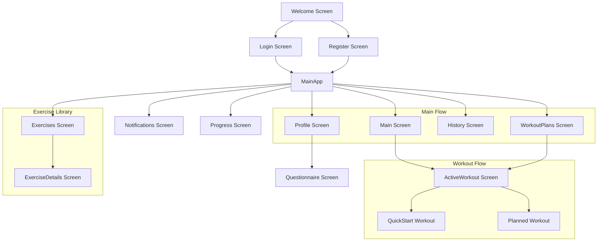

# 📊 תוכנית רפקטורינג מקיפה לפרויקט GYMovoo

## 📱 מפת זרימת המסכים המלאה



## 🗑️ קבצים וכפילויות שניתן להסיר

1. **קבצי גיבוי:**
   - `questionnaireService_backup.ts` - גיבוי ישן שאינו נחוץ
   - `*.backup.ts` - כל קבצי הגיבוי

2. **קבצים כפולים:**
   - מיזוג `ExerciseListScreen.tsx` ו-`ExercisesScreen.tsx` לקובץ אחד
   - מיזוג `ExerciseDetailsScreen.tsx` ו-`ExerciseDetailsModal.tsx` לקובץ אחד
   - איחוד תיקיות `exercise/` ו-`exercises/` לתיקייה אחת: `features/exercises/`

3. **שירותים מיותרים:**
   - איחוד `workoutStorageService.ts`, `workoutRecommendationService.ts` ו-`workoutFacadeService.ts`
   - איחוד `personalRecordService.ts` ו-`ProgressiveOverloadService.ts`

4. **שירותים שבכלל לא נמצאים בשימוש:**
   - בדיקה לגבי הצורך ב-`SmartSuggestionsEngine.ts` - אם אינו בשימוש, יש להסירו

## 🏗️ מבנה תיקיות מומלץ - מיפוי מלא

```
src/
├── core/                        # ליבת האפליקציה
│   ├── types/                   # הגדרות טיפוס מרכזיות
│   │   ├── index.ts            # נקודת ייצוא ראשית
│   │   ├── user.types.ts       # טיפוסי משתמש
│   │   ├── workout.types.ts    # טיפוסי אימון
│   │   └── questionnaire.types.ts # טיפוסי שאלון
│   │
│   ├── constants/               # קבועים גלובליים
│   │   ├── index.ts
│   │   ├── theme.ts            # ערכי עיצוב
│   │   └── config.ts           # הגדרות אפליקציה
│   │
│   ├── api/                     # תקשורת עם שרת
│   │   ├── index.ts
│   │   ├── client.ts           # לקוח API
│   │   └── supabase.ts         # הגדרות Supabase
│   │
│   └── utils/                   # כלים שימושיים
│       ├── index.ts
│       ├── logger.ts           # מערכת לוגים
│       ├── formatters.ts       # פורמט נתונים
│       └── validators.ts       # ולידציה
│
├── features/                    # פיצ'רים לפי תחומים
│   ├── auth/                    # אימות משתמש
│   │   ├── screens/            # מסכי אימות
│   │   │   ├── LoginScreen.tsx
│   │   │   ├── RegisterScreen.tsx
│   │   │   ├── TermsScreen.tsx
│   │   │   └── WelcomeScreen.tsx
│   │   ├── components/         # רכיבי אימות
│   │   └── services/           # שירותי אימות
│   │       └── auth.service.ts
│   │
│   ├── workout/                 # אימונים
│   │   ├── screens/            # מסכי אימון
│   │   │   ├── WorkoutPlansScreen.tsx
│   │   │   └── ActiveWorkoutScreen.tsx
│   │   ├── components/         # רכיבי אימון
│   │   │   ├── exercise-card/  # כרטיס תרגיל
│   │   │   ├── workout-header/ # כותרת אימון
│   │   │   └── timer/          # טיימר אימון
│   │   ├── hooks/              # הוקים ייעודיים
│   │   └── services/           # שירותי אימון
│   │       ├── workout.service.ts     # שירות ראשי
│   │       └── record.service.ts      # שיאים אישיים
│   │
│   ├── exercises/               # ספריית תרגילים
│   │   ├── screens/            # מסכי תרגילים
│   │   │   ├── ExercisesScreen.tsx     # רשימת תרגילים
│   │   │   └── ExerciseDetailsScreen.tsx # פרטי תרגיל
│   │   ├── components/         # רכיבי תרגילים
│   │   └── services/           # שירותי תרגילים
│   │
│   ├── questionnaire/           # שאלונים
│   │   ├── screens/            # מסכי שאלון
│   │   │   └── QuestionnaireScreen.tsx
│   │   ├── components/         # רכיבי שאלון
│   │   └── services/           # שירותי שאלון
│   │       └── questionnaire.service.ts
│   │
│   ├── profile/                 # פרופיל משתמש
│   │   ├── screens/            # מסכי פרופיל
│   │   │   └── ProfileScreen.tsx
│   │   ├── components/         # רכיבי פרופיל
│   │   └── services/           # שירותי פרופיל
│   │
│   ├── history/                 # היסטוריית אימונים
│   │   ├── screens/            # מסכי היסטוריה
│   │   │   └── HistoryScreen.tsx
│   │   ├── components/         # רכיבי היסטוריה
│   │   └── services/           # שירותי היסטוריה
│   │
│   ├── main/                    # מסך ראשי
│   │   ├── screens/            # מסך ראשי
│   │   │   └── MainScreen.tsx
│   │   └── components/         # רכיבי מסך ראשי
│   │
│   ├── progress/                # התקדמות
│   │   ├── screens/            # מסכי התקדמות
│   │   │   └── ProgressScreen.tsx
│   │   └── components/         # רכיבי התקדמות
│   │
│   └── notifications/           # התראות
│       ├── screens/            # מסכי התראות
│       │   └── NotificationsScreen.tsx
│       └── components/         # רכיבי התראות
│
├── navigation/                  # ניווט
│   ├── index.ts                # נקודת כניסה
│   ├── AppNavigator.tsx        # ניווט ראשי
│   ├── BottomNavigation.tsx    # תפריט תחתון
│   └── types.ts                # טיפוסים לניווט
│
├── shared/                      # רכיבים משותפים
│   ├── components/              # רכיבי UI
│   │   ├── Button/             # כפתורים
│   │   ├── Card/               # כרטיסים
│   │   ├── Modal/              # חלונות מודליים
│   │   └── Typography/         # טקסטים
│   │
│   ├── hooks/                   # הוקים משותפים
│   │   ├── useForm.ts          # טפסים
│   │   └── useToast.ts         # הודעות
│   │
│   ├── assets/                  # נכסים
│   │   ├── images/             # תמונות
│   │   └── icons/              # אייקונים
│   │
│   └── store/                   # ניהול מצב גלובלי
│       ├── index.ts            # נקודת כניסה
│       ├── userStore.ts        # מצב משתמש
│       └── workoutStore.ts     # מצב אימונים
│
└── App.tsx                      # כניסה ראשית
```

## 🧩 מבנה טיפוסים מרכזי מומלץ

### 1. טיפוסי המשתמש (`user.types.ts`)

```typescript
// src/core/types/user.types.ts
export interface User {
  id: string;
  email: string;
  name: string;
  provider: "google" | "apple" | "manual";
  avatar?: string;

  // Questionnaire
  hasQuestionnaire: boolean;
  questionnaireData?: QuestionnaireData;

  // Stats
  trainingStats?: TrainingStats;
  activityHistory?: ActivityHistory[];

  // Subscription
  subscription?: Subscription;

  // Metadata
  metadata?: UserMetadata;
}

export interface QuestionnaireData {
  answers: QuestionnaireAnswers;
  metadata: QuestionnaireMetadata;
  completedAt: string;
  version: string;
}

export interface UserMetadata {
  createdAt: string;
  lastLoginAt: string;
  deviceInfo?: DeviceInfo;
}
```

### 2. טיפוסי אימון (`workout.types.ts`)

```typescript
// src/core/types/workout.types.ts
export interface WorkoutPlan {
  id: string;
  name: string;
  description: string;
  type: "basic" | "smart" | "premium";
  duration: number; // days
  difficulty: "beginner" | "intermediate" | "advanced";
  workouts: WorkoutTemplate[];
  targetMuscles: string[];
  frequency?: number;
  isActive: boolean;
  createdAt: string;
  updatedAt: string;
}

export interface WorkoutTemplate {
  id: string;
  name: string;
  type: "strength" | "cardio" | "hiit" | "flexibility" | "mixed";
  exercises: ExerciseTemplate[];
  duration: number;
  difficulty: "beginner" | "intermediate" | "advanced";
  targetMuscles: string[];
  equipment: string[];
  dayNumber: number;
}

export interface ExerciseTemplate {
  exerciseId: string;
  name: string;
  sets: number;
  reps?: number | string;
  duration?: number;
  restTime: number;
  equipment: string;
  targetMuscles: string[];
}

export interface Set {
  id: string;
  type: "warmup" | "working" | "cooldown";
  targetReps?: number;
  actualReps?: number;
  targetWeight?: number;
  actualWeight?: number;
  duration?: number;
  restTime: number;
  completed: boolean;
  isPR?: boolean;
  timeToComplete?: number;
}
```

### 3. טיפוסי שאלון (`questionnaire.types.ts`)

```typescript
// src/core/types/questionnaire.types.ts
export interface QuestionnaireMetadata {
  completedAt: string;
  version: string;
  lastUpdated?: string;
}

export interface QuestionnaireAnswers {
  // Basic Info
  age?: number | string;
  gender?: "male" | "female" | "other";
  weight?: number;
  height?: number;

  // Goals
  fitness_goal?: string | string[];
  experience?: string;

  // Equipment
  equipment?: string[];
  home_equipment?: string[];
  workout_location?: string;

  // Availability
  workout_frequency?: string | number;
  workout_duration?: string | number;

  // Health
  injuries?: string[];
  limitations?: string[];

  // Diet
  diet_preference?: string;

  [key: string]: unknown;
}
```

### 4. נקודת ייצוא ראשית (`index.ts`)

```typescript
// src/core/types/index.ts
// Re-export all types
export * from "./user.types";
export * from "./workout.types";
export * from "./questionnaire.types";

// Validation utilities
export const isUser = (obj: unknown): obj is User => {
  // Implementation...
};

export const isWorkoutPlan = (obj: unknown): obj is WorkoutPlan => {
  // Implementation...
};
```

## 🔄 זרימת מסכים מפורטת

### 1. WelcomeScreen (מסך כניסה ראשוני)

- **כפתורים**:
  - כניסה → LoginScreen
  - הרשמה → RegisterScreen
  - כניסה מהירה → MainScreen (אם זמין)

### 2. LoginScreen (התחברות)

- **כפתורים**:
  - התחבר → MainScreen (אם מילא שאלון) או QuestionnaireScreen (אם לא)
  - שכחתי סיסמה → ForgotPasswordScreen
  - חזרה → WelcomeScreen

### 3. MainScreen (מסך בית)

- **רכיבים**:
  - כרטיס האימון הבא
  - סטטיסטיקות מהירות
  - חדשות ועדכונים
- **כפתורים**:
  - התחל אימון מהיר → ActiveWorkoutScreen
  - צפה בכל התרגילים → ExercisesScreen

### 4. WorkoutPlansScreen (תוכניות אימון)

- **רכיבים**:
  - רשימת תוכניות אימון
  - יצירת תוכנית חדשה
- **כפתורים**:
  - התחל אימון → ActiveWorkoutScreen
  - ערוך תוכנית → WorkoutEditScreen (לא קיים כרגע)

### 5. ActiveWorkoutScreen (אימון פעיל)

- **רכיבים**:
  - טיימר אימון
  - רשימת תרגילים
  - מידע על סטים
- **כפתורים**:
  - סיים אימון → WorkoutSummaryScreen (לא קיים כרגע)
  - דלג על תרגיל
  - הוסף תרגיל → ExercisesScreen

### 6. ExercisesScreen (רשימת תרגילים)

- **רכיבים**:
  - חיפוש תרגילים
  - סינון לפי קבוצות שרירים
  - רשימת תרגילים
- **כפתורים**:
  - בחר תרגיל → ExerciseDetailsScreen
  - חזרה → המסך הקודם

### 7. ProfileScreen (פרופיל משתמש)

- **רכיבים**:
  - מידע משתמש
  - הישגים
  - סטטיסטיקות
- **כפתורים**:
  - ערוך פרופיל
  - מלא שאלון מחדש → QuestionnaireScreen
  - הגדרות → SettingsScreen (לא קיים כרגע)

## 📝 סיכום לפעולה

1. **שלב ראשון - טיפול בכפילויות**:
   - איחוד ExerciseListScreen ו-ExercisesScreen
   - איחוד תיקיות exercise ו-exercises

2. **שלב שני - ארגון הטיפוסים**:
   - יצירת תיקיית core/types
   - מעבר של כל הטיפוסים לקבצים הייעודיים

3. **שלב שלישי - ארגון השירותים**:
   - איחוד שירותי workout
   - מחיקת קבצי גיבוי

4. **שלב רביעי - רפקטורינג מלא**:
   - ארגון מחדש לפי מבנה התיקיות המוצע
   - עדכון כל ה-imports

## 🚀 תובנות נוספות

1. **בעיות ביצועים אפשריות**:
   - ActiveWorkoutScreen כבד מדי - נדרש פירוק לרכיבים
   - רשימות ארוכות ללא virtualization

2. **נקודות לשיפור נוספות**:
   - הוספת קובץ logger מרכזי במקום console.log
   - הוספת React.memo לרכיבים כבדים
   - הוספת error boundaries לכל המסכים הראשיים
