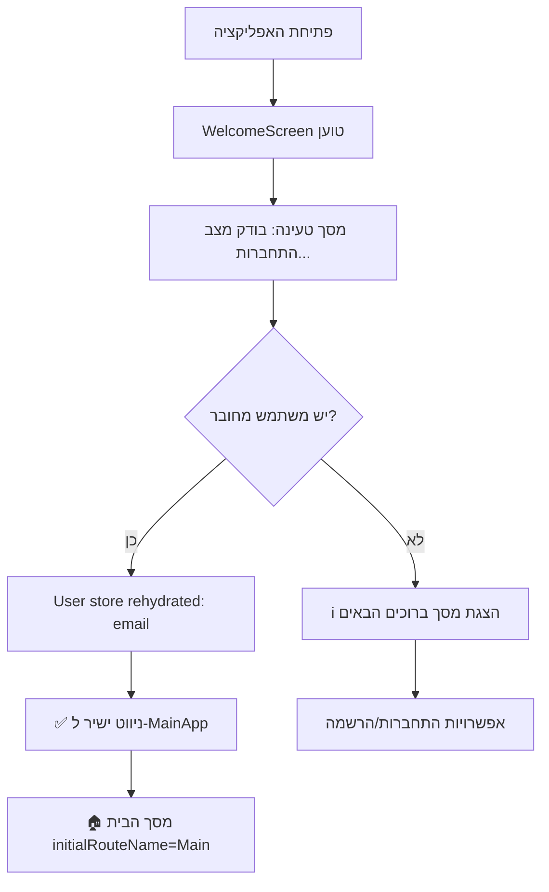

# 🔐 מדריך התחברות אוטומטית - Authentication Auto-Login Guide

> **📅 נוצר:** 1 באוגוסט 2025  
> **🎯 מטרה:** מדריך מקיף למערכת ההתחברות האוטומטית החדשה

## 🚀 מה השתנה?

### ❌ **לפני התיקון:**

- המשתמש נכנס תמיד למסך ברוכים הבאים
- צריך להיכנס שוב אפילו אם כבר מחובר
- חוויית משתמש מתסכלת

### ✅ **אחרי התיקון:**

- זיהוי אוטומטי של משתמש מחובר
- ניווט ישיר למסך הבית
- חוויית משתמש חלקה ומהירה

---

## 🔧 איך זה עובד טכנית?

### 1️⃣ **WelcomeScreen - הבדיקה הראשונית**

```typescript
// src/screens/welcome/WelcomeScreen.tsx
const [isCheckingAuth, setIsCheckingAuth] = useState(true);

useEffect(() => {
  const checkAuthStatus = async () => {
    try {
      console.log("🔍 WelcomeScreen - בודק מצב התחברות:", {
        hasUser: !!user,
        userEmail: user?.email,
        isLoggedInResult: isLoggedIn(),
      });

      // נתן זמן קצר ל-store להתחזר מ-AsyncStorage
      await new Promise((resolve) => setTimeout(resolve, 500));

      if (isLoggedIn() && user) {
        console.log(
          "✅ WelcomeScreen - משתמש מחובר נמצא! מנווט למסך הבית:",
          user.email
        );
        navigation.navigate("MainApp");
        return;
      }

      console.log("ℹ️ WelcomeScreen - משתמש לא מחובר, מציג מסך ברוכים הבאים");
      setIsCheckingAuth(false);
    } catch (error) {
      console.error("❌ WelcomeScreen - שגיאה בבדיקת מצב התחברות:", error);
      setIsCheckingAuth(false);
    }
  };

  checkAuthStatus();
}, [user, isLoggedIn, navigation]);
```

### 2️⃣ **מסך טעינה בזמן הבדיקה**

```typescript
// מסך טעינה בזמן בדיקת מצב התחברות
if (isCheckingAuth) {
  return (
    <LinearGradient
      colors={[theme.colors.background, theme.colors.backgroundAlt]}
      style={{ flex: 1, justifyContent: "center", alignItems: "center" }}
    >
      <MaterialCommunityIcons
        name="weight-lifter"
        size={80}
        color={theme.colors.primary}
      />
      <Text style={[styles.appName, { marginTop: 16 }]}>GYMovoo</Text>
      <ActivityIndicator
        size="large"
        color={theme.colors.primary}
        style={{ marginTop: 24 }}
      />
      <Text style={[styles.tagline, { marginTop: 16 }]}>
        בודק מצב התחברות...
      </Text>
    </LinearGradient>
  );
}
```

### 3️⃣ **BottomNavigation - התחלה במסך הבית**

```typescript
// src/navigation/BottomNavigation.tsx
return (
  <Tab.Navigator
    initialRouteName="Main" // מתחיל תמיד במסך הבית
    screenOptions={{
      // כל האפשרויות שלנו...
    }}
  >
    {/* פרופיל → היסטוריה → תוכניות → אימון → בית */}
    {/* אבל מתחילים מהבית! */}
  </Tab.Navigator>
);
```

---

## 📊 תהליך ההתחברות האוטומטית



---

## 🎯 יתרונות החדשים

### ✅ **חוויית משתמש משופרת**

- **חסכון זמן:** לא צריך להיכנס שוב
- **מהירות:** ניווט ישיר למסך הבית
- **נוחות:** זיכרון אוטומטי של המשתמש

### ✅ **ביצועים טובים יותר**

- **טעינה מהירה:** בדיקה של 500ms בלבד
- **אופטימיזציה:** אנימציות רק כשצריך
- **זיכרון חכם:** AsyncStorage אמין

### ✅ **אבטחה מתקדמת**

- **זיהוי בטוח:** בדיקת `isLoggedIn()` + `user`
- **ניקוי מלא:** התנתקות מוחקת הכל
- **עקביות:** עבודה עם 25+ מפתחות AsyncStorage

---

## 🔍 איך לבדוק שזה עובד?

### 1️⃣ **לוגים בקונסול:**

```
 (NOBRIDGE) LOG  User store rehydrated: dani.levi.workout@gmail.com
 (NOBRIDGE) LOG  🔍 WelcomeScreen - בודק מצב התחברות: {"hasUser": true, "isLoggedInResult": true, "userEmail": "dani.levi.workout@gmail.com"}
 (NOBRIDGE) LOG  ✅ WelcomeScreen - משתמש מחובר נמצא! מנווט למסך הבית: dani.levi.workout@gmail.com
```

### 2️⃣ **חוויית משתמש:**

- פתח את האפליקציה
- ראה "בודק מצב התחברות..." לרגע קצר
- הגע ישירות למסך הבית (לא למסך פרופיל!)

### 3️⃣ **בדיקת התנתקות:**

- התנתק מהאפליקציה
- פתח שוב → אמור להגיע למסך ברוכים הבאים

---

## 📝 מה צריך לזכור במפתחים הבאים?

1. **WelcomeScreen** הוא נקודת הכניסה הראשונה
2. **initialRouteName="Main"** חובה ב-BottomNavigation
3. **timeout של 500ms** נותן זמן ל-AsyncStorage
4. **לוגים מפורטים** עוזרים בבדיקת בעיות
5. **מסך טעינה** משפר את חוויית המשתמש

---

## 🎉 תוצאה סופית

המערכת עכשיו עובדת בדיוק כמו שצריך:

- **משתמש מחובר** → מסך הבית ישירות
- **משתמש לא מחובר** → מסך ברוכים הבאים
- **חוויה חלקה** ללא עיכובים מיותרים

🎯 **המטרה הושגה:** אפליקציה שזוכרת את המשתמש ומעבירה אותו ישירות למקום הנכון!
