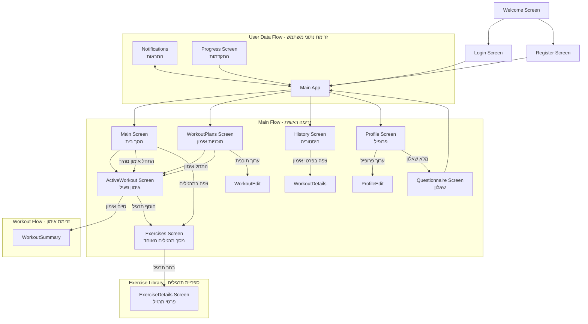

# 📊 תוכנית רפקטורינג מותאמת אישית לפרויקט GYMovoo

## 🎯 הגדרת מטרות הרפקטורינג

בהתבסס על התשובות שנתת, התוכנית ממוקדת ב:

1. **ארגון לפי פיצ'רים** - מבנה תיקיות מודולרי לפי תחומים פונקציונליים
2. **מרכוז טיפוסים** - טיפוסים מוגדרים במקום מרכזי למניעת כפילויות
3. **קוד נקי וקל לתחזוקה** - דגש על קריאות ותחזוקתיות הקוד
4. **הפחתת שגיאות TypeScript** - שימוש ב-TypeScript במצב קפדני (strict mode)
5. **תיעוד מקיף** - תיעוד מפורט לכל פונקציה וקומפוננטה

## 📱 מפת זרימת המסכים המעודכנת



## 🏗️ מבנה תיקיות מומלץ - לפי תשובותיך

```
src/
├── core/                      # ליבת האפליקציה
│   ├── types/                 # טיפוסים מרוכזים (לפי בחירתך)
│   │   ├── index.ts          # נקודת ייצוא מרכזית
│   │   ├── user.types.ts     # טיפוסי משתמש
│   │   ├── workout.types.ts  # טיפוסי אימון
│   │   └── questionnaire.types.ts # טיפוסי שאלון
│   │
│   ├── constants/             # קבועים גלובליים
│   │   ├── index.ts
│   │   └── theme.ts          # ערכי עיצוב
│   │
│   └── validation/            # ולידציה
│       └── validators.ts      # פונקציות ולידציה
│
├── features/                  # פיצ'רים לפי תחומים (לפי בחירתך)
│   ├── auth/                  # אימות
│   │   ├── screens/          # מסכי אימות
│   │   │   ├── LoginScreen.tsx
│   │   │   ├── RegisterScreen.tsx
│   │   │   └── WelcomeScreen.tsx
│   │   ├── components/       # רכיבים פנימיים
│   │   ├── services/         # שירותי אימות
│   │   └── context/          # Context API לאימות
│   │
│   ├── workout/               # אימונים
│   │   ├── screens/          # מסכי אימון
│   │   │   ├── WorkoutPlansScreen.tsx
│   │   │   ├── ActiveWorkoutScreen.tsx
│   │   │   └── WorkoutSummaryScreen.tsx
│   │   ├── components/       # רכיבים פנימיים
│   │   │   ├── exercise-card/  # כרטיס תרגיל (מפוצל לרכיבים קטנים)
│   │   │   ├── workout-timer/  # טיימר אימון
│   │   │   └── set-row/        # שורת סט (מפוצל לרכיבים קטנים)
│   │   ├── services/         # שירותי אימון מאוחדים
│   │   │   └── workout.service.ts  # שירות אימון מרכזי
│   │   └── context/          # Context API לאימונים
│   │
│   ├── exercises/             # ספריית תרגילים מאוחדת
│   │   ├── screens/          # מסכי תרגילים מאוחדים
│   │   │   ├── ExercisesScreen.tsx  # מסך תרגילים מאוחד
│   │   │   └── ExerciseDetailsScreen.tsx  # פרטי תרגיל
│   │   ├── components/       # רכיבים פנימיים
│   │   ├── services/         # שירותי תרגילים
│   │   └── context/          # Context API לתרגילים
│   │
│   ├── questionnaire/         # שאלונים
│   │   ├── screens/          # מסך שאלון (מפוצל ללשוניות)
│   │   │   └── QuestionnaireScreen/
│   │   │       ├── index.tsx
│   │   │       ├── BasicInfoTab.tsx
│   │   │       ├── GoalsTab.tsx
│   │   │       └── EquipmentTab.tsx
│   │   ├── components/       # רכיבים פנימיים
│   │   └── services/         # שירותי שאלון
│   │       └── questionnaire.service.ts
│   │
│   ├── profile/               # פרופיל
│   │   ├── screens/          # מסכי פרופיל
│   │   ├── components/       # רכיבים פנימיים
│   │   └── context/          # Context API לפרופיל
│   │
│   ├── history/               # היסטוריה
│   │   ├── screens/          # מסכי היסטוריה
│   │   └── components/       # רכיבים פנימיים
│   │
│   ├── main/                  # מסך ראשי (בית)
│   │   ├── screens/          # מסך בית
│   │   └── components/       # רכיבים פנימיים
│   │
│   └── progress/              # התקדמות
│       ├── screens/          # מסכי התקדמות
│       └── components/       # רכיבים פנימיים
│
├── navigation/                # ניווט
│   ├── AppNavigator.tsx      # ניווט ראשי
│   ├── BottomNavigation.tsx  # תפריט תחתון
│   └── types.ts              # טיפוסים לניווט
│
├── shared/                    # רכיבים משותפים
│   ├── components/            # רכיבי UI משותפים
│   │   ├── Button/           # כפתורים
│   │   ├── Card/             # כרטיסים
│   │   ├── Form/             # רכיבי טופס
│   │   ├── Modal/            # חלונות מודליים
│   │   └── Tabs/             # לשוניות (לפי בחירתך)
│   │
│   ├── hooks/                 # הוקים משותפים
│   │   └── useForm.ts        # ניהול טפסים
│   │
│   ├── utils/                 # כלים שימושיים
│   │   ├── logger.ts         # מערכת לוגים
│   │   └── formatters.ts     # עיצוב טקסט ותאריכים
│   │
│   └── assets/                # נכסים גרפיים (מאוחסנים מקומית לפי בחירתך)
│       ├── images/           # תמונות
│       └── icons/            # אייקונים
│
└── App.tsx                    # כניסה ראשית
```

## 🗑️ קבצים וכפילויות שיש להסיר

### 1. קבצי גיבוי ומיותרים

- `questionnaireService_backup.ts` - גיבוי מיותר (שמור גיבוי לפני מחיקה)
- `*.backup.ts` - כל קבצי הגיבוי

### 2. איחוד קבצים כפולים

- מיזוג `ExerciseListScreen.tsx` + `ExercisesScreen.tsx` → `ExercisesScreen.tsx` חדש
- מיזוג `ExerciseDetailsScreen.tsx` + `ExerciseDetailsModal.tsx` → `ExerciseDetailsScreen.tsx` חדש
- איחוד התיקיות `exercise/` + `exercises/` → `features/exercises/`

### 3. איחוד שירותים מפוצלים

- איחוד שירותי workout (`workoutStorageService.ts`, `workoutRecommendationService.ts` וכו') לשירות אחד
- איחוד כל שירותי התרגילים

## 🔄 תוכנית פעולה מדורגת - לפי העדפותיך

### שלב 1: הכנת מבנה הטיפוסים (2-3 ימים)

1. **יצירת תיקיית `core/types`**

   ```bash
   mkdir -p src/core/types
   ```

2. **יצירת קבצי טיפוסים מרכזיים**
   - `user.types.ts` - הגדרות משתמש
   - `workout.types.ts` - הגדרות אימון
   - `questionnaire.types.ts` - הגדרות שאלון
   - `index.ts` - ייצוא מרכזי

3. **העברת כל הגדרות הטיפוס למקום המרכזי**
   - בדיקה ואיחוד כפילויות
   - הוספת תיעוד מפורט לכל טיפוס
   - מעבר להגדרות strict (קפדניות)

### שלב 2: פיצול מסכים גדולים (3-4 ימים)

1. **פיצול ActiveWorkoutScreen**
   - פיצול לרכיבים קטנים עם אחריות ברורה
   - הוצאת לוגיקה לשירותים ייעודיים

2. **פיצול QuestionnaireScreen ללשוניות**
   - יצירת לשוניות (tabs) נפרדות לכל חלק בשאלון
   - יצירת רכיבים משותפים

3. **טיפול ב-SetRow המורכב**
   - פיצול למספר רכיבים קטנים יותר
   - הפרדת לוגיקה מתצוגה

### שלב 3: איחוד קבצים כפולים (2-3 ימים)

1. **איחוד מסכי תרגילים**
   - בדיקת פונקציונליות של שני המסכים
   - יצירת מסך אחד עם פרמטר mode
   - עדכון כל ההפניות למסכים הישנים

2. **איחוד שירותים מפוצלים**
   - סקירה של כל השירותים והפונקציונליות
   - איחוד שירותים דומים תוך שמירה על תיעוד

### שלב 4: הוספת Context API ותיעוד (2-3 ימים)

1. **יצירת Context לכל פיצ'ר**
   - Context לאימונים
   - Context לתרגילים
   - Context לפרופיל

2. **תיעוד מפורט**
   - תיעוד לכל פונקציה ורכיב
   - תיעוד ברמת המודול
   - יצירת README לכל תיקייה

### שלב 5: מיגרציה למבנה תיקיות חדש (3-4 ימים)

1. **יצירת מבנה תיקיות חדש**

   ```bash
   mkdir -p src/{core,features,shared,navigation}
   mkdir -p src/features/{auth,workout,exercises,questionnaire,profile,history,main,progress}
   mkdir -p src/shared/{components,hooks,utils,assets}
   ```

2. **העברת קבצים למבנה החדש**
   - העברה עם שמירת גיבויים (לפי העדפתך)
   - עדכון של כל ה-imports

## 🧪 אסטרטגיית טסט ווידוא

1. **בדיקת שגיאות TypeScript לאחר כל שלב**

   ```bash
   npx tsc --noEmit
   ```

2. **בדיקת פונקציונליות ידנית**
   - רשימת צ'קליסט למסכים ופיצ'רים
   - וידוא שהכל עובד כמצופה

3. **שימור המצב הקיים בענף Git**
   - שמירת גיבוי של הקבצים המקוריים
   - עבודה בענף נפרד

## 📝 דוגמא למבנה טיפוסים מומלץ (מעודכן לפי תשובות)

### `user.types.ts`

```typescript
/**
 * הגדרות טיפוס משתמש
 * @file src/core/types/user.types.ts
 * @description מכיל את כל הגדרות הטיפוס הקשורות למשתמש
 */

/**
 * ממשק משתמש מרכזי
 * @interface User
 */
export interface User {
  /** מזהה ייחודי למשתמש */
  id: string;
  /** כתובת אימייל */
  email: string;
  /** שם המשתמש */
  name: string;
  /** ספק האימות - כרגע תמיכה בגוגל ואימות ידני */
  provider: "google" | "manual";
  /** URL לתמונת פרופיל */
  avatar?: string;

  /** האם המשתמש השלים שאלון */
  hasQuestionnaire: boolean;
  /** נתוני השאלון של המשתמש - כל התשובות המלאות */
  questionnaireData?: QuestionnaireData;

  /** סטטיסטיקות אימון מצטברות */
  trainingStats: TrainingStats;
  /** היסטוריית אימונים מלאה עם פרטים */
  activityHistory: WorkoutHistory[];

  /** פרטי מנוי - קובע אילו תכונות זמינות */
  subscription: {
    type: "free" | "premium" | "trial";
    startDate: Date;
    endDate?: Date;
    active: boolean;
  };

  /** מטא-דאטה - תאריכי הרשמה וכניסה אחרונה */
  metadata: {
    registrationDate: Date;
    lastLoginDate: Date;
  };

  /** מדידות גוף כולל היסטוריה */
  bodyMeasurements: {
    weight: BodyMeasurementRecord[];
    height?: number;
    // מדידות נוספות...
  };

  /** מטרות אימון - מבוססות על נתוני השאלון */
  trainingGoals: TrainingGoal[];

  /** הישגים שהושגו */
  achievements: Achievement[];
}

/**
 * מדידת משקל או מידות גוף עם תאריך
 */
export interface BodyMeasurementRecord {
  value: number;
  date: Date;
  notes?: string;
}

// הגדרות נוספות...
```

> **הערה**: המבנה המעודכן מבוסס על התשובות לשאלות. ראה קובץ `user-types-analysis.md` למבנה מלא ומפורט.## 🔄 זרימת נתונים מומלצת

בהתאם לבחירותיך, זרימת הנתונים תהיה:

1. **ברמת הפיצ'ר**:
   - Context API לכל פיצ'ר
   - נתונים מקומיים בכל אזור פונקציונלי

2. **ברמה הגלובלית**:
   - Zustand למידע המשתמש
   - Cache היברידי (זיכרון + AsyncStorage)

3. **העברת נתונים בין מסכים**:
   - שילוב של Context ופרמטרים בניווט
   - נתונים זמניים - פרמטרים בניווט
   - נתונים חשובים - שמירה ב-Context

4. **טיפול בשגיאות**:
   - מניעת שגיאות דרך TypeScript קפדני
   - ניסיון פעולה מחדש אוטומטי בבעיות תקשורת

5. **UI וזרימת משתמש**:
   - לשוניות (tabs) בתוך מסכים גדולים
   - אחסון נכסים מקומי
   - אופטימיזציה לטלפונים ניידים
