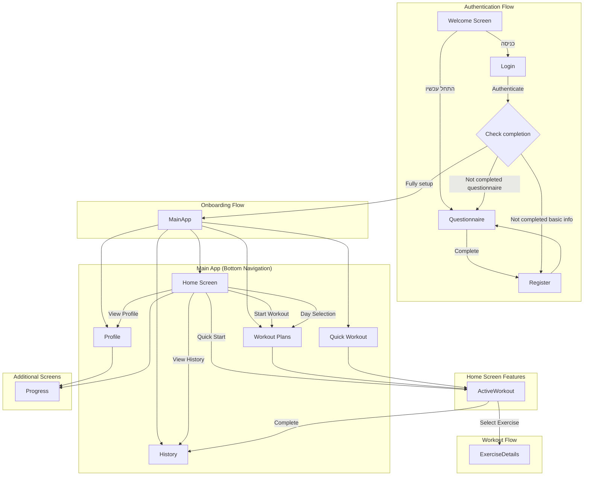
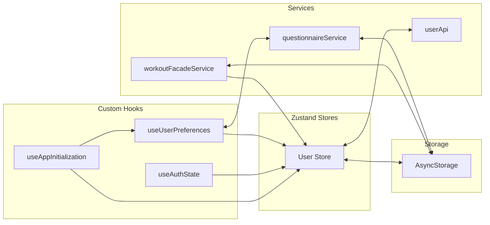
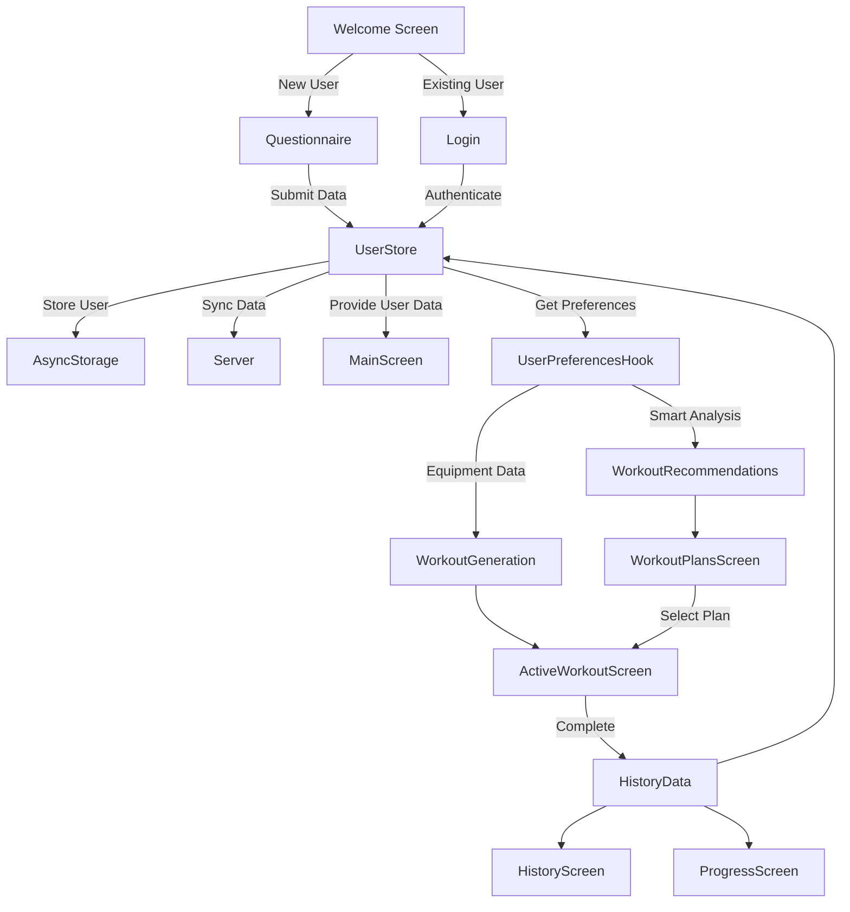

# Navigation Structure and User Flow Diagram

```mermaid
flowchart TD
    subgraph "Authentication Flow"
        Welcome[Welcome Screen] --> |"התחל עכשיו"| Questionnaire
        Welcome --> |"כניסה"| Login
        Login --> |Authenticate| CompletionCheck{Check completion}
        Register --> Questionnaire
    end

    subgraph "Onboarding Flow"
        Questionnaire --> |Complete| Register
        CompletionCheck --> |Not completed questionnaire| Questionnaire
        CompletionCheck --> |Not completed basic info| Register
        CompletionCheck --> |Fully setup| MainApp
    end

    subgraph "Main App (Bottom Navigation)"
        MainApp --> Main[Home Screen]
        MainApp --> WorkoutPlans[Workout Plans]
        MainApp --> History[History]
        MainApp --> Profile[Profile]
        MainApp --> QuickWorkout[Quick Workout]
    end

    subgraph "Home Screen Features"
        Main --> |Start Workout| WorkoutPlans
        Main --> |Day Selection| WorkoutPlans
        Main --> |View History| History
        Main --> |View Profile| Profile
        Main --> |Quick Start| ActiveWorkout
    end

    subgraph "Workout Flow"
        WorkoutPlans --> ActiveWorkout
        QuickWorkout --> ActiveWorkout
        ActiveWorkout --> |Complete| History
        ActiveWorkout --> |Select Exercise| ExerciseDetails
    end

    subgraph "Additional Screens"
        Profile --> Progress
        Main --> Progress
    end
```

# State Management Overview

```mermaid
flowchart LR
    subgraph "Zustand Stores"
        UserStore[User Store]
    end

    subgraph "Custom Hooks"
        UserPreferences[useUserPreferences]
        AuthState[useAuthState]
        AppInit[useAppInitialization]
    end

    subgraph "Services"
        QuestionnaireService[questionnaireService]
        WorkoutService[workoutFacadeService]
        UserAPI[userApi]
    end

    subgraph "Storage"
        AsyncStorage[AsyncStorage]
    end

    UserStore <--> AsyncStorage
    UserStore <--> UserAPI

    UserPreferences --> UserStore
    UserPreferences <--> QuestionnaireService

    AuthState --> UserStore

    AppInit --> UserStore
    AppInit --> UserPreferences

    QuestionnaireService <--> AsyncStorage
    WorkoutService <--> AsyncStorage
    WorkoutService --> UserStore
```

# User Data Flow

```mermaid
flowchart TD
    WelcomeScreen[Welcome Screen] --> |New User| Questionnaire
    WelcomeScreen --> |Existing User| Login

    Questionnaire --> |Submit Data| UserStore
    Login --> |Authenticate| UserStore

    UserStore --> |Store User| AsyncStorage
    UserStore --> |Sync Data| Server

    UserStore --> |Provide User Data| MainScreen
    UserStore --> |Get Preferences| UserPreferencesHook

    UserPreferencesHook --> |Smart Analysis| WorkoutRecommendations
    UserPreferencesHook --> |Equipment Data| WorkoutGeneration

    WorkoutRecommendations --> WorkoutPlansScreen
    WorkoutGeneration --> ActiveWorkoutScreen

    WorkoutPlansScreen --> |Select Plan| ActiveWorkoutScreen
    ActiveWorkoutScreen --> |Complete| HistoryData

    HistoryData --> UserStore
    HistoryData --> HistoryScreen
    HistoryData --> ProgressScreen
```
