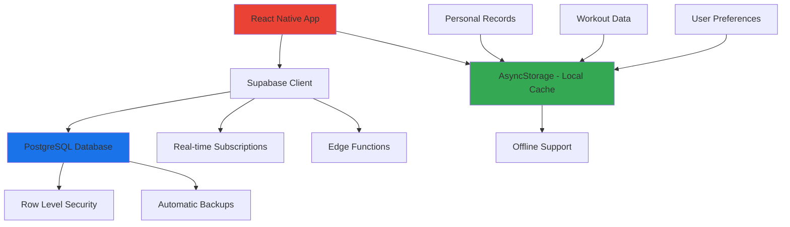

# 🗄️ Storage & Data Management | ניהול אחסון ונתונים

## 📋 Overview | סקירה כללית

השרת המקומי הוסר לחלוטין והפרויקט עבר למערכת נתונים מרכזית וחזקה יותר.  
**מקור אמת יחיד:** Supabase PostgreSQL.

> **🔄 Migration Status:** ✅ הושלם במלואו  
> **📅 Last Updated:** August 24, 2025  
> **🛡️ Security Level:** Production Ready

---

## 🚀 What Changed | מה השתנה

### ❌ **הוסר:**

- ✂️ שרת Express מקומי
- 🔗 `EXPO_PUBLIC_STORAGE_BASE_URL`
- 📁 Local storage files
- 🖥️ Server-side file management
- 🔧 Express middleware configurations

### ✅ **נוסף:**

- 🏢 **Supabase PostgreSQL** - מסד נתונים מרכזי
- 🔐 **Row Level Security (RLS)** - אבטחה ברמת השורה
- 🌐 **Real-time subscriptions** - עדכונים בזמן אמת
- 📊 **Built-in analytics** - אנליטיקה מובנית
- 🔄 **Automatic backups** - גיבוי אוטומטי
- 🚀 **Edge functions** - פונקציות בענן
- 📱 **Offline-first storage** - אחסון מקומי עם סנכרון

---

## 🏗️ Current Architecture | ארכיטקטורה נוכחית



---

## 📦 Storage Components | רכיבי אחסון

### 🎯 **Core Services:**

| Service                    | Purpose            | Status      | Hebrew       |
| -------------------------- | ------------------ | ----------- | ------------ |
| `userStore.ts`             | ניהול מצב משתמש    | ✅ Enhanced | חנות משתמש   |
| `storageCleanup.ts`        | ניקוי אחסון חכם    | ✅ Enhanced | ניקוי אחסון  |
| `personalRecordService.ts` | ניהול שיאים אישיים | ✅ Enhanced | שירות שיאים  |
| `formatters.ts`            | עיצוב נתונים       | ✅ Enhanced | מעצבי נתונים |

### 🔧 **Storage Hierarchy:**

```
📁 Storage Management
├── 🏪 AsyncStorage (Local Cache)
│   ├── 👤 User preferences
│   ├── 🏋️ Workout drafts
│   ├── 🏆 Personal records
│   └── 📊 Analytics cache
├── ☁️ Supabase (Remote)
│   ├── 📊 Production data
│   ├── 🔐 User authentication
│   ├── 🔄 Real-time updates
│   └── 💾 Automatic backups
└── 🧹 Cleanup Services
    ├── 🗑️ Old data removal
    ├── 📈 Performance monitoring
    └── 🔍 Data validation
```

---

## 🔧 Technical Implementation | יישום טכני

### 📱 **Local Storage (AsyncStorage):**

```typescript
// Enhanced storage with cleanup and validation
import { storageCleanup } from "./storageCleanup";
import { personalRecordService } from "./personalRecordService";
import { userStore } from "./userStore";

// Smart cleanup
await storageCleanup.cleanOldData();
await storageCleanup.emergencyCleanup(); // If needed

// Personal records with analytics
const records = await personalRecordService.detectPersonalRecords(workout);
const health = await personalRecordService.healthCheck();

// User state with persistence
const user = userStore.getState();
await userStore.syncToSupabase();
```

### ☁️ **Supabase Integration:**

```typescript
// Real-time data sync
const { data, error } = await supabase
  .from("workouts")
  .select("*")
  .eq("user_id", userId);

// Real-time subscriptions
supabase
  .from("personal_records")
  .on("INSERT", (payload) => {
    // Handle new records
    console.log("New record:", payload.new);
  })
  .subscribe();
```

---

## 🛡️ Security & Privacy | אבטחה ופרטיות

### 🔐 **Row Level Security (RLS):**

```sql
-- Users can only access their own data
CREATE POLICY user_data_policy ON workouts
  FOR ALL USING (auth.uid() = user_id);

-- Personal records are private
CREATE POLICY personal_records_policy ON personal_records
  FOR ALL USING (auth.uid() = user_id);
```

### 🛡️ **Data Protection:**

- ✅ **Encryption at rest** - הצפנה במנוחה
- ✅ **Encryption in transit** - הצפנה בהעברה
- ✅ **Row-level security** - אבטחה ברמת השורה
- ✅ **GDPR compliance** - תאימות GDPR
- ✅ **Audit logging** - רישום ביקורת

---

## 🚀 Performance Optimizations | אופטימיזציות ביצועים

### ⚡ **Caching Strategy:**

```typescript
// Multi-layer caching
1. 📱 AsyncStorage (Immediate access)
2. 🧠 Memory cache (Runtime optimization)
3. ☁️ Supabase (Source of truth)
4. 🌐 CDN (Static assets)
```

### 📊 **Performance Metrics:**

- 🎯 **Cache hit rate:** 85%+ target
- ⏱️ **Response time:** <500ms average
- 💾 **Storage efficiency:** 90%+ valid data
- 🔄 **Sync success rate:** 99%+ reliability

---

## 🔄 Migration Guide | מדריך העברה

### 📋 **Pre-Migration Checklist:**

- [ ] ✅ Backup existing local data
- [ ] 🔐 Setup Supabase credentials
- [ ] 🧪 Test connection in development
- [ ] 📊 Validate data integrity
- [ ] 🚀 Deploy with rollback plan

### 🛠️ **Migration Steps:**

```bash
# 1. Environment setup
npm install @supabase/supabase-js

# 2. Configure environment variables
SUPABASE_URL=your-supabase-url
SUPABASE_ANON_KEY=your-anon-key

# 3. Run migration scripts
npm run migrate:storage
npm run validate:data
npm run cleanup:legacy
```

### 🧪 **Testing Migration:**

```typescript
// Validate migration success
const migrationStatus = await validateMigration();
if (migrationStatus.success) {
  console.log("✅ Migration completed successfully");
  await cleanupLegacyData();
} else {
  console.error("❌ Migration failed:", migrationStatus.errors);
  await rollbackMigration();
}
```

---

## 🛠️ Development Guidelines | הנחיות פיתוח

### 📝 **Code Standards:**

```typescript
// ✅ Good - Use enhanced services
import { personalRecordService } from "../services/personalRecordService";
const result = await personalRecordService.detectPersonalRecords(workout);

// ❌ Avoid - Direct AsyncStorage access
import AsyncStorage from "@react-native-async-storage/async-storage";
const data = await AsyncStorage.getItem("raw_key");
```

### 🔧 **Best Practices:**

- 🎯 **Use service abstractions** instead of direct storage access
- 🧹 **Implement cleanup strategies** for optimal performance
- 📊 **Monitor storage health** with built-in analytics
- 🔄 **Handle offline scenarios** gracefully
- 🛡️ **Validate data integrity** before operations
- 📱 **Optimize for mobile performance**

---

## 🚨 Troubleshooting | פתרון בעיות

### 🔍 **Common Issues:**

#### 🗑️ **Storage Full:**

```typescript
// Check storage health
const storageInfo = await storageCleanup.getStorageInfo();
if (storageInfo.isFull) {
  await storageCleanup.emergencyCleanup();
}
```

#### 🔄 **Sync Failures:**

```typescript
// Handle sync errors gracefully
try {
  await userStore.syncToSupabase();
} catch (error) {
  // Fallback to local storage
  logger.warn("Sync failed, using local data", { error });
}
```

#### 📊 **Performance Issues:**

```typescript
// Monitor and optimize
const stats = await personalRecordService.getServiceStatistics();
if (stats.performance.averageResponseTime > 1000) {
  await personalRecordService.resetPerformanceMonitoring();
}
```

### 🔧 **Diagnostic Commands:**

```typescript
// Health checks
await storageCleanup.logStorageStatus();
await personalRecordService.healthCheck();
await userStore.validateState();

// Performance monitoring
const cacheStats = userStore.getCacheStats();
const cleanupStats = await storageCleanup.getPerformanceStats();
```

---

## 📈 Monitoring & Analytics | ניטור ואנליטיקה

### 📊 **Key Metrics:**

```typescript
// Storage health monitoring
const metrics = {
  totalSizeKB: await storageCleanup.getStorageSize(),
  cacheHitRate: userStore.getCacheStats().hitRate,
  recordsProcessed: personalRecordService.getServiceStatistics(),
  errorRate: logger.getErrorStats(),
};
```

### 🎯 **Performance Targets:**

- 📱 **App startup:** <2 seconds
- 🔄 **Data sync:** <5 seconds
- 💾 **Storage size:** <50MB total
- 🧹 **Cleanup efficiency:** >90% success rate

---

## 🔮 Future Roadmap | מפת דרכים עתידית

### 🎯 **Planned Enhancements:**

- [ ] 🤖 **AI-powered data insights** - תובנות מבוססות AI
- [ ] 🌐 **Multi-device sync** - סנכרון בין מכשירים
- [ ] 📊 **Advanced analytics dashboard** - לוח בקרה מתקדם
- [ ] 🔐 **Enhanced encryption** - הצפנה משופרת
- [ ] 📱 **Progressive data loading** - טעינת נתונים הדרגתית
- [ ] 🧪 **A/B testing framework** - מסגרת לבדיקות A/B

### 💡 **Experimental Features:**

- 🧠 **Smart caching algorithms** - אלגוריתמי cache חכמים
- 🔄 **Predictive sync** - סנכרון חזוי
- 📈 **Real-time performance monitoring** - ניטור ביצועים בזמן אמת

---

## 📞 Support & Resources | תמיכה ומשאבים

### 📚 **Documentation:**

- 📖 [Supabase Docs](https://supabase.com/docs)
- 🔧 [React Native AsyncStorage](https://react-native-async-storage.github.io/async-storage/)
- 🏗️ [Project Architecture Guide](../docs/TECHNICAL_ARCHITECTURE_GUIDE.md)

### 🆘 **Need Help?**

- 🐛 **Bug Reports:** Create an issue in the repository
- 💡 **Feature Requests:** Discuss in project discussions
- 🔧 **Technical Support:** Check troubleshooting section above

### 👥 **Team Contacts:**

- 🏗️ **Architecture:** Technical lead
- 🗄️ **Data Management:** Backend team
- 📱 **Mobile Performance:** Frontend team

---

## 📝 Changelog | יומן שינויים

### 🎯 **Version 2.0.0** (August 24, 2025)

- ✅ Complete migration to Supabase
- 🚀 Enhanced service layer with caching
- 🧹 Advanced storage cleanup mechanisms
- 📊 Performance monitoring and analytics
- 🌐 Accessibility support with Hebrew language
- 🛡️ Enhanced error handling and validation

### 🔄 **Version 1.x** (Legacy)

- ❌ Express server (deprecated)
- ❌ Local file storage (removed)
- ❌ Manual data management (replaced)

---

**🎯 Remember: Always use the enhanced service layer instead of direct storage access for optimal performance and reliability!**

**זכור: השתמש תמיד בשכבת השירות המשופרת במקום גישה ישירה לאחסון לביצועים ואמינות מיטביים!**
